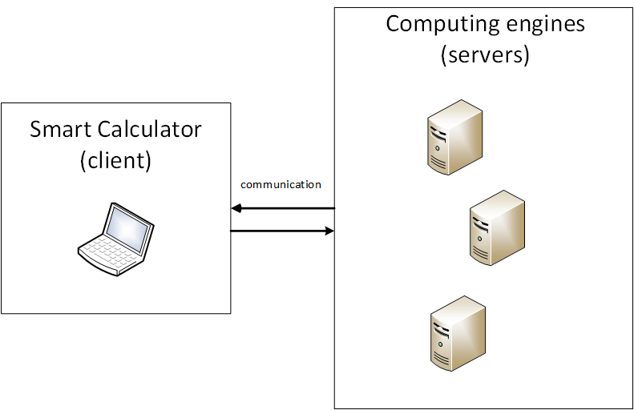
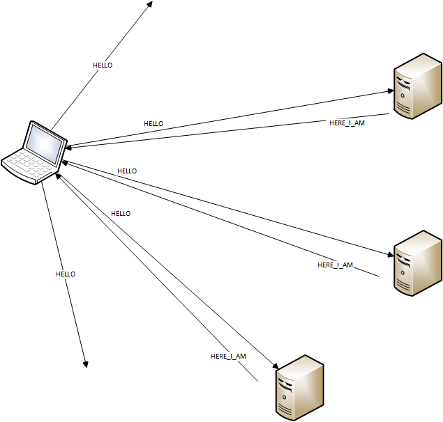
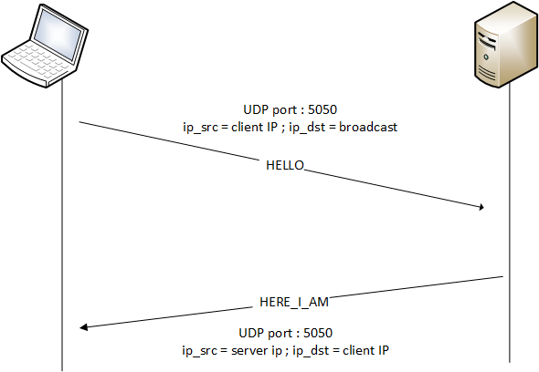
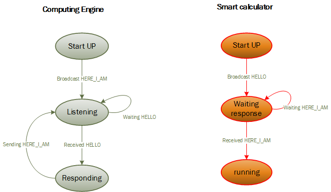

# Distributed Computing Protocol V1.0 Specification : Dynamic Discovery


```
Author              : Olivier Liechti, HEIG-VD
Last revision date  : 21.03.2014

Modified by			: Simone Righitto , Anthony Roubaty
date				: 30.03.2014

Revision history
         27.03.2014 : added messages specification
         30.03.2014 : writing chapter 1,2,3 and 5
		 30.03.2014 : completed the message specification

```

## 1. Introduction

This specification is about the Dynamic Discovery protocol used in the first step of the Distributed Computing Protocol. It is essential for a client to be able to know all computing engines before starting
speak with them. So we can say that the main goal of the discovery protocol is to let a client discovery all available Computing engines.

Just to introduce the general idea:
This protocol uses some defined messages and the broadcasting technique. 
The protocol is divided in 2 possible scenario:
- The client start up and need to discovery computing engines 
- A computing engine start up and need to announce itself to already active clients

But before starting with technical details here a brief overview of covered Chapters:
```
2. Terminology 		   : glossary section
3. System Architecture : show the system architecture (components and interactions between components)
4. Protocol Details    : important details for developers who need to implements the protocol
5. Examples			   : some example 
6. References          : ;-)
```

## 2. Terminology

>This is a glossary section, we will fix some terms that are used in this specification

**Computing engine**: the server side in the protocol. It is a machine that let a client execute commands

**Smart calculator**: the client side in the protocol. It is a machine that need a computing engine to execute commands


## 3. Protocol Overview

>The protocol is based on the idea of "I need you, where are you?" and the response "I'm at ...". Basically a client start up and need to know the IP address and port where a computing engine is listening.
The client send an HELLO message over broadcast and then listen to computing engines HERE_I_AM messages.


### 3.1. System Architecture

>Insert at least one **component diagram** here, to show a high-level overview of the system. The diagram should show the different types of components, their interfaces and their high-level interactions.

<center></center>

### 3.2. System Components

- Smart calculator : the client side of the protocol. 
- Computing engine: the server side of the protocol. 


#### 3.2.1. Smart calculator

> The smart calculator is a machine that want access at computing services provided by computing engine. The principal role of a client in this protocol is to broadcast HELLO messages at start, and to listen to HERE_I_AM computing engine response (response message that could be directly addresses to client IP or broadcasted )


#### 3.2.2. Computing engine

> The computing engine is a machine that must listen for clients HELLO message and it must provide HERE_I_AM messages. The response message is provided at a specified smart calculator when a HELLO message is recieved or it is broadcasted when the computing engine start up.

### 3.3. Interactions Between Components

>Here we can see what the discovery broadcast look like
<center></center>

>And with more details
<center></center>


## 4. Protocol Details

>In this section, we will describe all details of our Dynamic Discovery protocol.

### 4.1. Transport Protocols and Connections

>The Dynamic Discovery protocol works over UDP and uses port 5050.

>The first step before a client can establish a connection with the server it must know his address. 
Computing engines are listening over UDP (port 5050) for HELLO message from clients. When a client start up and need to connect to a computing engine it will send a HELLO message on broadcast mode
over UDP (port 5050). The server receive the HELLO call and send back an UDP datagram to the client containing his IP address and the TCP port where is listening for connection (TCP port 6060). This response message is called HERE_I_AM. 


### 4.2. State Management

>In this section we can see the state diagram of our protocol

<center></center>


#### 4.2.1. Computing engine state

#### 4.2.1.0 Start UP

>This is the first state of a computing engine. When the application start the first thing it does is send a HERE_I_AM message to inform eventual smart calculator already running that a new computer engine is disponible

#### 4.2.1.1 Listening

>After having informed all already started clients the server listen on UDP port 5050 for HELLO messages

#### 4.2.1.2 Responding

>When an HELLO message is received, the computing engine must respond to the client who has sent the HELLO with the HERE_I_AM message

#### 4.2.2. Smart calculator state

#### 4.2.2.0 StartUP

>This is the first state of smart calculator. When the application start the first thing to do is broadcast an HELLO message to receive all disponibles computing engines

#### 4.2.2.1 Waiting response

>After sending the HELLO, the client must wait for incoming HERE_I_AM messages

#### 4.2.2.2 running

>The running state is a state that is not defined on the discovery protocol. This state is intended to communicate with the server using informations received with the HERE_I_AM message and the specification
is given on the second part of the Distributed Computing Protocol.

### 4.3. Message Types, Syntax and Semantics

>In this section, you should describe in details what messages are exchanged by system components, how they are structured and encoded, when they should be sent and what should happen when they are received.

> It is a good idea to write one paragraph for each type of message. Very often, you will also want to document some decisions that are valid for all messages. For example, you could state that all messages are encoded in JSON or in XML. Or, if you are using a grammar in your specification, you could state what kind of grammar it is and document the high-level production rules. Also, many protocol define a common structure for several message types, often involving the separation between an envelope (with headers) and a payload. This structure and the role of the headers may then be specified in an additional section that would be added here.

#### 4.3.1. UDP messages

>The next messages are used for a first contact between a client and a computing engine 

##### 4.3.1.1 HELLO
> message sent by a client who need the list of computing engines

##### 4.3.1.2 HERE_I_AM
> message sent by the computing engine to announce it selfe to the client


### 4.4. Miscellaneous Considerations

> Depending on the actual system and protocol, you will need to address additional issues and specify various elements. Typical topics that are covered in protocol specifications include reliability, caching, scalability, content negotiation, encoding formats and others. You will have to adapt this part of the template to describe what is relevant to your own situation. If you have many questions to answer, then you will most likely split this section into multiple sections.

### 4.5. Security Considerations

>In many protocol specifications, security aspects of the protocol are treated in a dedicated section. Sometimes, the authentication, authorization, confidentiality rules are specified in the main protocol specification. Very often, however, the main protocol specification defines a generic mechanism (e.g. it states that requests should contain an authentication header, without fully specifying what should be transmitted in the header). Other specification documents are then written to use this extension point and to specify one or more different ways to actually handle the authentication in a system implementation. The HTTP specification follows this approach, with authentication mechanisms specified in [RFC 2617](https://tools.ietf.org/html/rfc2617). 

## 5. Examples

>In this section, you should **give examples of interactions between the components** of the distributed system. In previous sections, you have specified detailed rules (messaging patterns, session states, message syntax and semantics, etc.). Developers will use these detailed specifications when they implement your protocol.

>But by providing examples in the document, **you will help them in two ways**. Firstly, it will be **easier for them to understand what your protocol does and how**. Analyzing at a concrete dialog between a client and a server is often easier than directly digging into a more abstract definition. Secondly, it will allow them to **confirm their understanding of the protocol specification**. After reading the different rules specified in the previous sections, they will have a way to check that they have understood them correctly.


## 6. References

>Very often, you will provide references to other protocol specifications and/or to other documents. This is something that you should do in a specific section of your document.
